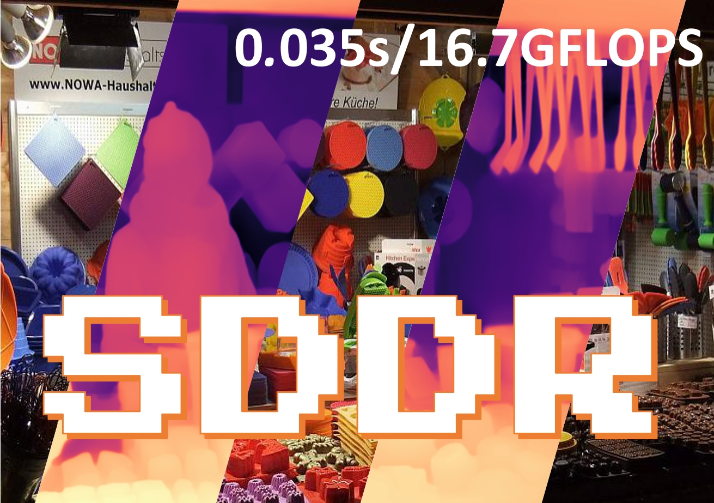

# Self-Distilled Depth Refinement with Noisy Poisson Fusion (NeurIPS2024) 🚀🚀🚀

🎉🎉🎉 **Welcome to the SDDR GitHub repository!** 🎉🎉🎉

Authors: [Jiaqi Li](https://scholar.google.com/citations?hl=zh-CN&user=i-2ghuYAAAAJ)&sup1;,
[Yiran Wang](https://scholar.google.com.hk/citations?hl=zh-CN&user=p_RnaI8AAAAJ)&sup1;,
[Jinghong Zheng](https://scholar.google.com/citations?user=sLTEDCsAAAAJ&hl=zh-CN)&sup1;,
[Zihao Huang](https://orcid.org/0000-0002-8804-191X)&sup1;,
[Ke Xian](https://sites.google.com/site/kexian1991/)&sup1;,
[Zhiguo Cao](http://english.aia.hust.edu.cn/info/1085/1528.htm)&sup1;,
[Jianming Zhang](https://jimmie33.github.io/)&sup2;,

Institutes: &sup1;Huazhong University of Science and Technology, &sup2;Adobe Research





## Envs

```bash
pip install -r requirements.txt
```

## Demo

### OneStage

As an example of reasoning on middlebury, the input parameters are the weight path, the rgb folder path, the output path, and the folder path predicted by the base high and low resolutions.

```bash
python demo.py  --weight checkpoints/model_dict_1_5600.pt \
		--rgb demo_input/Middlebury2021/rgb \
		--output demo_output/Middlebury2021/LeRes_Fusion \
		--low demo_input/Middlebury2021/LeRes/low_448 \
		--high demo_input/Middlebury2021/LeRes/high_1920 

# or you can simply run this for middlebury2021 inference(all parameters are set to default)
python demo.py
```

The official metrics can be verified directly using the `previous_evaluate_mid21.py` (the [middlebury2021 dataset](https://vision.middlebury.edu/stereo/data/scenes2021/zip/all.zip) needs to be unzipped to demo_input/Middlebury2021/GTData)

### TwoStage

The two-stage prediction will be saved in `demo_output/Middlebury2021/LeRes_2stage/mid21_final`, the metric verification is the same as above.(Default base model is set to LeRes50)

```bash
python demo.py  --weight checkpoints/model_dict_1_5600.pt \
		--rgb demo_input/Middlebury2021/rgb \
		--twostage
```
